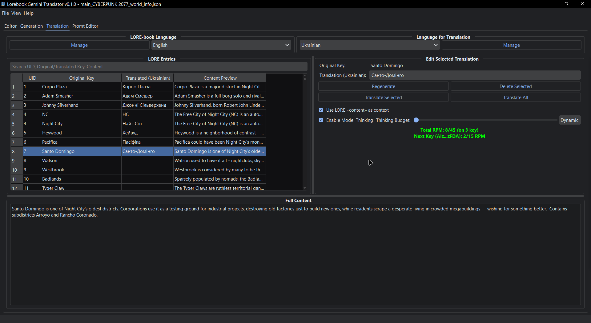

[](../README.md)
[](README/README_UA.md)

# Lorebook Gemini Translator

## 📖 Опис

Додаток, призначений для перекладу ключів/тригерів LORE-book з однієї мови на іншу за допомогою Gemini.

**Навіщо?** Якщо ви граєте, наприклад, українською мовою, ключ/тригер з книги LORE, написаної англійською (або будь-якою іншою мовою), ніколи не буде працювати! Ось чому вам потрібно перекласти ключі/тригери.


---

## ✨ Ключові Особливості

*   **Переклад LORE-book:** Переклад ключів/тригерів з вашого LORE-book.
*   **Інтеграція з Gemini:** Використовує моделі ШІ Gemini для перекладу.
*   **Керування мовами:** Додавайте/видаляйте/обирайте вихідну та цільову мови.
*   **Пакетні операції:**
    *   Перекласти всі записи.
    *   Перекласти вибрані записи.
    *   Регенерувати вибрані переклади.
*   **Ручне редагування:** Змінюйте переклади безпосередньо в додатку.
*   **Контекстний переклад:** Використовуйте поле `content` запису для покращення якості перекладу (вимкніть, якщо відповіді порожні).
*   **Виведення "думок" моделі:** Додає системну підказку “thinking” для покращення якості перекладу. *Іноді простіші моделі (наприклад, `gemini-2.0-flash`) працюють з нею навіть краще.* (вимкніть, якщо відповіді порожні.)
*   **Кеш перекладів:**
    *   Автоматичне збереження прогресу.
    *   Без втрати даних при випадковому закритті або збої живлення.
    *   Кеш зберігається для кожного файлу: `<lorebook_name>_translation_cache.json`
*   **Моніторинг RPM (запитів на хвилину):**
    *   Візуальний індикатор та затримки для уникнення перевищення лімітів Gemini API.
    *   Настроювані пороги RPM.
*   **Останні файли:** Швидкий доступ до раніше відкритих LORE-book.
*   **Експорт перекладів:** Об'єднуйте оригінальні ключі з перекладами в експортований файл для використання в SillyTavern.

---

## 🚀 Легкий Запуск (Windows)
1.  **Переконайтеся, що Python 3.9+ встановлено:** Завантажте та встановіть Python з [python.org](https://www.python.org/downloads/), якщо ви ще цього не зробили. **Обов'язково позначте "Add Python to PATH" під час встановлення.**
2.  **Завантажте лаунчер:**
    *   Перейдіть до [релізів](https://github.com/Ner-Kun/Lorebook-Gemini-Translator/releases).
    *   Завантажте файл `run_translator.bat`.
    *   (Або ж, склонуйте весь репозиторій та знайдіть `run_translator.bat` у кореневій директорії).
3.  **Запуск:**
    *   Розмістіть `run_translator.bat` у вибраній вами папці.
    *   Двічі клацніть `run_translator.bat`.
    *   При наступних запусках він активує існуюче середовище та запустить додаток.

---
## ✅ TODO (Завдання)

### 🚀 Пріоритетні Завдання
- [ ] **🔁 Ротація API ключів:** Реалізувати механізм для роботи з кількома API ключами.
- [ ] **🔑 Генерація синонімів для ключів:** Додати функцію для запиту до ШІ списку синонімів для вибраного ключа цільовою мовою.
- [ ] **🔑 Генерація ключів з помилками:** Реалізувати можливість генерації варіантів ключів з поширеними друкарськими помилками.
- [ ] **🔑 Генерація форм множини для ключів:** Додати опцію для автоматичного створення форм множини для вибраного ключа.
- [ ] **🔑 Видобування ключів із вмісту ("content"):** Впровадити функцію, що дозволяє ШІ аналізувати поле "content" запису LORE та пропонувати список потенційних ключів на основі його тексту.

### 🛠️ Основний Функціонал
- [ ] **📖 Переклад основного вмісту LORE (поля "content"):** Реалізувати переклад не тільки для ключів, але й для основного вмісту записів LORE (Для великих моделей це не так важливо, тому не є пріоритетом).
- [ ] **🔍 Пошук у Lorebook:** Додати функцію пошуку для завантаженого lorebook (за ключем, вмістом, перекладами).

### ☁️ API та Моделі
- [ ] **🌐 Підтримка альтернативних бекендів:** Додати підтримку Chutes.ai/OpenRouter.ai.
- [ ] **🤖 Перехресна перевірка двома моделями:** Можливість перехресної перевірки/порівняння результатів між двома різними моделями.

### 💡 Майбутні Функції
- [ ] **📝 Агресивне стиснення "content" для LLM:** Функція для стиснення поля "content" за допомогою ШІ з метою максимального збереження суті при мінімальному обсязі, для використання в моделях з обмеженим контекстом. *Головна мета – машиночитаний, а не людиночитаний результат.*
- [ ] **🌎 Локалізація інтерфейсу**

### 🤔 Різне
- [ ] ❓ Можливо, щось ще... ідеї вітаються!

---

## 🛠️ Вимоги (Вручну)

[]()  [](https://pypi.org/project/PyQtDarkTheme-fork/)  [](https://aistudio.google.com/app/apikey)
*(Примітка: Якщо ви використовуєте скрипт `run_translator.bat` у Windows, Python є єдиною прямою вимогою.)*

---

## ⚙️ Встановлення (Вручну)

1.  **Склонуйте репозиторій:**
    ```bash
    git clone https://github.com/Ner-Kun/Lorebook-Gemini-Translator.git
    cd Lorebook-Gemini-Translator
    ```

2.  **Встановіть залежності:**
    ```bash
    pip install PySide6 google-generativeai pyqtdarktheme-fork
    ```

---

## 🔧 Налаштування

### 1. API Ключ

* При першому запуску вас попросять ввести ваш Google Gemini API ключ. ([Отримати ключ](https://aistudio.google.com/app/apikey))
* Ви також можете отримати доступ до налаштувань у будь-який час через `File > Settings`.

### 2. Модель Gemini

* За замовчуванням: `gemini-2.5-flash-preview-05-20`
* Можна змінити через `File > Settings`
* Деякі моделі можуть вимагати платних тарифів — див. [ліміти швидкості](https://ai.google.dev/gemini-api/docs/rate-limits#free-tier)

### 3. Мови

* **Вихідна мова:** Оригінальна мова ключів вашого LORE-book (за замовчуванням: Англійська)
* **Цільові мови:** Додайте будь-яку кількість цільових мов

---

## ▶️ Використання

1. **Запустіть програму:**
    ```bash
    python "Lorebook Gemini Translator.py"
    ```
    **(або просто запустіть `run_translator.bat` у Windows)**

2. **Введіть API ключ**, коли буде запропоновано. (_Ви можете отримати API ключ тут - [тримати ключ](https://aistudio.google.com/app/apikey)_)

3. **Відкрийте LORE-book:** через меню або кнопку "Open LORE-book".

4. **Оберіть Мови:**
    * Встановіть вихідну мову.
    * Встановіть цільову мову.

5. **Переклад:**
    * Перекладайте окремі, вибрані або всі записи.
    * Регенеруйте записи, якщо потрібно.

6. **Редагування/Збереження:**
    * Редагуйте переклади вручну.
    * Зберігається миттєво в кеш.

7. **Керування Кешем:**
    * Очистіть конкретні або всі переклади для мови.

8. **Експортуйте перекладений LORE-book:**
    * Натисніть “Export LORE-book” або `File > Save As...`
    * Повністю сумісний з SillyTavern та подібними інструментами.

---
💬 Якщо вам сподобався інструмент — поставте ⭐ на GitHub або запропонуйте покращення!