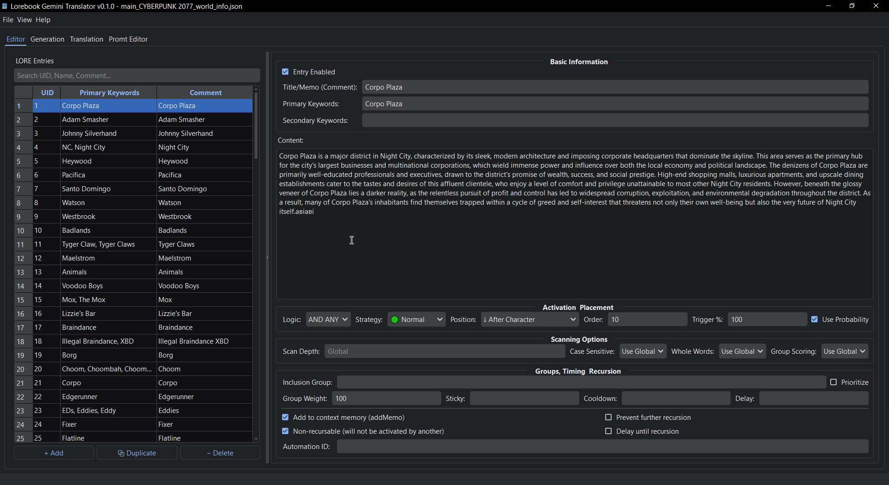
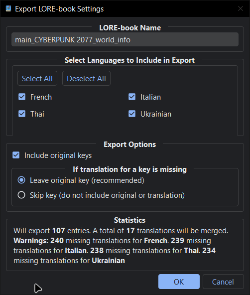
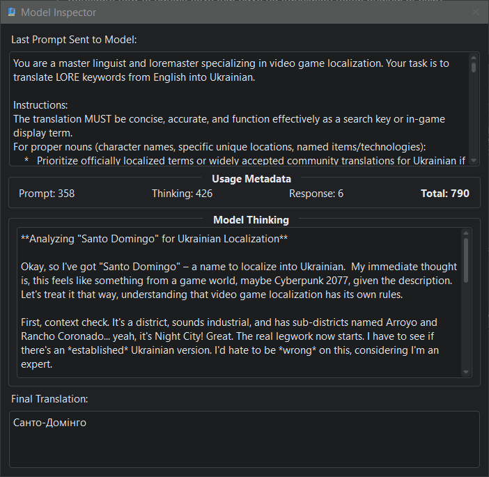

# Lorebook Gemini Translator

[](../README.md)
[](README/README_UA.md)
[](README/README_ru.md)

## 📖 Описание

Приложение, разработанное для помощи в переводе ключей/триггеров лорбуков с одного языка на другой с помощью Gemini. Оно также содержит полнофункциональный редактор лорбуков.

**Зачем это нужно?** Если вы, например, играете на украинском, ключ/триггер из лорбука, написанный на английском (или любом другом языке), никогда не сработает! Именно поэтому ключи/триггеры нужно переводить.

---

## ✨ Ключевые особенности

* **Интерфейс с вкладками:** Отдельные, специализированные вкладки "Редактор" и "Перевод" для упрощения рабочего процесса.
* **Полнофункциональный редактор лорбуков:**
  * Создавайте, редактируйте и удаляйте записи лорбука прямо в приложении.
  * Функционал, разработанный, чтобы быть похожим на редактор SillyTavern.
  * Создавайте новые, пустые лорбуки с нуля (`File > New`).
* **Перевод:**
  * Переводите ключевые строки из вашего лорбука с помощью моделей Gemini AI.
  * **Контекстный перевод:** Используйте поле `content` записи для улучшения качества перевода.
  * **«Мышление» модели:** Можно включить мышление (по умолчанию включено) для улучшения качества перевода, с возможностью настройки бюджета токенов.
* **Управление API:**
  * **Ротация API-ключей:** Используйте список API-ключей. Приложение автоматически чередует их, чтобы обойти ограничения RPD (запросов в день).
  * **Умная обработка ошибок:** Если ключ достигает своего лимита, он временно отключается, и приложение плавно переключается на следующий. Неудачные задачи автоматически возвращаются в очередь.
  * **Динамическое ограничение скорости:** Приложение автоматически рассчитывает оптимальную задержку между запросами на основе RPM. Оно даже реагирует на сообщения об ошибках API, чтобы корректировать скорость "на лету".
* **Пакетные операции и поиск:**
  * Переводите все или выбранные записи.
  * Повторно генерируйте переводы для выбранных записей.
  * **Поиск:** Быстро находите записи по ключу, содержимому или переводу на вкладках "Редактор" и "Перевод".
* **Кэш и автосохранение:**
  * **Автосохранение в реальном времени:** Все изменения в редакторе и переводах автоматически сохраняются в фоновом режиме. Больше никакой потерянной работы!
  * Символ `*` в заголовке окна указывает на несохраненные изменения.
  * Кэш сохраняется для каждого файла отдельно: `<lorebook_name>_translation_cache.json` и `<lorebook_name>_edit.json`.
* **Автоматические обновления:** Приложение проверяет наличие новых версий при запуске и может обновить себя.
* **Мониторинг RPM:** Визуальный индикатор показывает текущий API-ключ и его статус.
* **Гибкий экспорт:**
  * Диалоговое окно экспорта предоставляет полный контроль.
  * Выбирайте, какие языки перевода включить в файл.
  * Решайте, включать ли оригинальные ключи.
  * Настраивайте, как обрабатывать ключи без перевода (сохранять оригинал или пропускать).

### 📸 Скриншоты

<!-- markdownlint-disable MD033 -->
<!-- markdownlint-disable MD003 -->
<!-- markdownlint-disable MD023 -->
<details>
  <summary>🖼️ Нажмите, чтобы просмотреть скриншоты</summary>
  <br>

  **Переводчик**
  

  **Редактор**
  

  **Экспорт**
  

  **Инспектор**
  
</details>
<!-- markdownlint-enable MD033 -->
<!-- markdownlint-enable MD003 -->
<!-- markdownlint-enable MD023 -->

---
💬 Если вам нравится инструмент — поставьте ему ⭐ на GitHub или предложите улучшение

---

## 🚀 Простой запуск (Windows)

1. **Убедитесь, что у вас установлен Python 3.9+:** Скачайте и установите Python с [python.org](https://www.python.org/downloads/), если у вас его еще нет. **Обязательно установите флажок "Add Python to PATH" во время инсталляции.**
2. **Скачайте лаунчер:**
    * Перейдите в раздел [Releases](https://github.com/Ner-Kun/Lorebook-Gemini-Translator/releases).
    * Скачайте файл `run_translator.bat`.
3. **Запуск:**
    * Разместите `run_translator.bat` в любой папке.
    * Дважды щелкните `run_translator.bat`, чтобы запустить приложение.
    * Подождите немного...
    * Приложение автоматически проверит наличие обновлений при запуске.

---

## 🛠️ Требования (для ручной установки)

  [](https://pypi.org/project/PyQtDarkTheme-fork/)   [](https://aistudio.google.com/app/apikey)

---

## ⚙️ Установка (ручная)

> ⚠️ **Примечание для ручной установки (v0.1.x):** Этот метод предназначен для опытных пользователей. Встроенный автообновлятор (`update.bat`) разработан для работы с виртуальной средой, создаваемой `run_translator.bat`. Ручная установка **не сможет** использовать автообновлятор. Это будет исправлено в будущих версиях.

1. **Клонируйте репозиторий:**

    ```bash
    git clone https://github.com/Ner-Kun/Lorebook-Gemini-Translator.git
    cd Lorebook-Gemini-Translator
    ```

2. **Установите зависимости:**

    ```bash
    pip install PySide6 google-genai google-api-core requests packaging pyqtdarktheme-fork rich
    ```

---

## 🔧 Настройка

### 1. API-ключ

* При первом запуске вам будет предложено ввести ваш API-ключ(и) Google Gemini. ([Получить ключ](https://aistudio.google.com/app/apikey))
* Также сразу посмотрите на ограничения RPM и выставьте нужные для выбранной вами модели (по умолчанию всё уже настроено). Google их часто меняет - [Смотреть здесь](https://ai.google.dev/gemini-api/docs/rate-limits)
* Приложение поддерживает **список API-ключей**. Вы можете добавить несколько ключей в настройках (`File > Settings`), и приложение будет чередовать их для управления лимитами запросов.

### 2. Модель Gemini

* По умолчанию: `gemini-2.5-flash-lite-preview-06-17`
* Можно изменить через `File > Settings`.
* Некоторые модели могут требовать платных тарифов — смотрите [лимиты запросов](https://ai.google.dev/gemini-api/docs/rate-limits#free-tier).

### 3. Языки

* **Source Language:** Исходный язык ключей вашего лорбука (по умолчанию: английский).
* **Target Languages:** Добавьте любое количество целевых языков.

---

## ▶️ Использование

1. **Запустите приложение:**

    ```bash
    python Lorebook_Gemini_Translator.py
    ```

    *(или просто запустите `run_translator.bat` в Windows)*

2. **Откройте лорбук:** через меню. Вы также можете создать новый через `File > New`.

3. **Навигация в приложении:**
    * Используйте вкладку **Editor** для просмотра, добавления или изменения записей лорбука.
    * Используйте вкладку **Translation** для управления переводами.

4. **Перевод:**
    * Установите исходный и целевые языки.
    * Переводите отдельные, выбранные или все записи.
    * Используйте строку поиска для быстрого нахождения записей.

5. **Редактирование/Сохранение:**
    * Редактируйте переводы или содержимое лорбука вручную.
    * Изменения автоматически сохраняются в файл кэша.

6. **Экспорт переведенного лорбука:**
    * Нажмите “Export LORE-book”.
    * Используйте расширенные параметры экспорта для настройки финального файла.
    * Экспортированный файл полностью совместим с SillyTavern и подобными инструментами.

---

## ✅ Планы на будущее

### 🛠️ Основной функционал

* [ ] **📖 Перевод основного контента лорбука (поля "content"):** Реализовать перевод основного содержимого записей лорбука.
* [ ] **🔧 Улучшить ручную установку:** Переработать механизм автообновления, чтобы он был совместим с ручной/git-установкой, которая не использует предоставленный скрипт `run_translator.bat` и его виртуальную среду.
* **Генерация ключей с помощью ИИ:**
  * [ ] **🔑 Генерация синонимов для ключей:** Добавить функцию запроса к ИИ для получения списка синонимов для выбранного ключа на целевом языке.
  * [ ] **🔑 Генерация ключей с ошибками:** Реализовать возможность генерировать вариации ключей с распространенными опечатками.
  * [ ] **🔑 Генерация форм множественного числа для ключей:** Добавить опцию для автоматического создания форм множественного числа для выбранных ключей.
  * [ ] **🔑 Извлечение ключей из контента:** Внедрить функцию, позволяющую ИИ анализировать поле "content" записи и предлагать список потенциальных ключей на основе его текста.

### ☁️ API и Модели

* [ ] **🌐 Поддержка альтернативных бэкендов:** Добавить поддержку Chutes.ai/OpenRouter.ai для предоставления большего выбора моделей и надежных способов обхода лимитов.
* [ ] **🤖 Перекрестная проверка двумя моделями:** Возможность перекрестной проверки/сравнения результатов между двумя разными моделями или сервисами.

### 💡 Будущие функции

* [ ] **📝 Агрессивное сжатие поля "content" для LLM:** Функция для сжатия поля "content" с помощью ИИ для максимального сохранения сути при минимальном объеме, для использования в моделях с ограниченным контекстом. *Основная цель — машиночитаемый, а не человекочитаемый результат.*
* [ ] **🌎 Локализация интерфейса**

### 🤔 Разное

* [ ] ❓ Возможно, что-то еще... идеи приветствуются!

### ✅ Выполнено

* [x] **🔁 Ротация API-ключей:** Реализован механизм для работы с несколькими API-ключами. (v0.1.0)
* [x] **🔍 Поиск:** Добавлена функция поиска. (v0.1.0)
* [x] **📝 Редактор лорбуков:** Функционал редактора сделан похожим на SillyTavern. (v0.1.0)
* [x] **💾 Автосохранение в реальном времени:** Приложение сохраняет всё автоматически. (v0.1.0)
* [x] **🚀 Автоматические обновления:** Приложение автоматически проверяет наличие новых версий и предлагает обновиться (также автоматически). (v0.1.0)
* [x] **🔧 Самоконтроль RPM:** Реализована возможность снижать RPM, если пользователь установил его выше, чем возможно. (v0.1.0)
